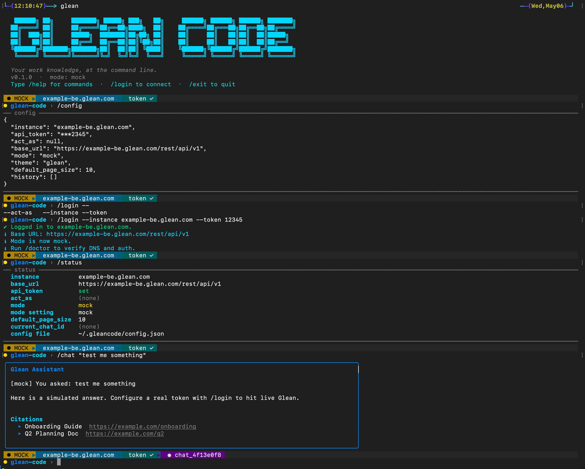
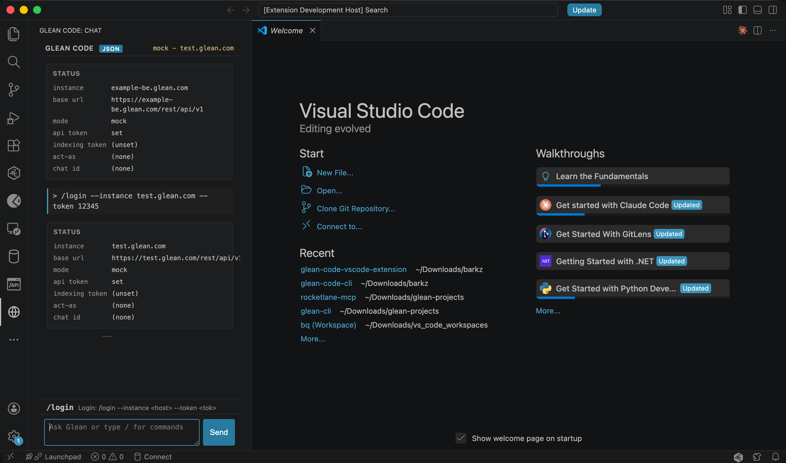

# Glean Code

A local, terminal-first client for the Glean Client REST API. Inspired by Claude Code. Built in Python with zero runtime dependencies.



## What you get

- Slash commands covering every major Glean Client API surface: chat, search, agents, tools, docs, people, shortcuts (Go Links), answers, summarize, verification, messages, activity, announcements, collections, pins, and insights
- **Near-complete Indexing API coverage** — 32 of 37 endpoints exposed as commands across read/debug, single-record write, bulk, and process-all tiers
- Full in-terminal documentation for every command via `/help <command>`
- Tab completion that cycles through matches as you type — press Tab to step forward, Shift+Tab to step back
- Powerline-style status bar showing mode, connected instance, auth state, and active chat thread
- Datasource status enrichment via the Indexing API — uploaded/indexed counts, coverage %, and processing history
- Indexing **debug toolkit** — `/debug.document`, `/debug.documents`, `/debug.user`, and `/documents.access` answer "is this doc uploaded?", "why can't user X see doc Y?", and "what groups did we upload for this user?" without leaving the REPL
- Indexing **observability counters** — `/datasources.config`, `/documents.count`, `/documents.status`, and `/users.count` for quick health checks of any custom datasource
- Indexing **write surface** — single-record `/index.document`, `/index.user`, `/index.group`, `/index.membership` (plus their `/index.delete-*` partners) and `/index.permissions`, all driven by `--from-file <json>` so request bodies stay auditable
- Indexing **bulk + paged uploads** — `/index.bulk-documents|users|groups|memberships`, `/people.bulk-employees|teams`, `/shortcuts.bulk-index`, `/shortcuts.upload`, plus `/index.process-all-*` and `/people.process-all-employees-teams` to kick off long-running rebuilds
- `/scaffold` to generate a self-contained Python starter project for chat, search, or agent use cases
- MCP server (`glean_mcp.py`) for Claude Code, Claude Desktop, and Cursor
- Config stored at `~/.gleancode/config.json` — supports both Client and Indexing API tokens
- Mock mode by default so you can try every command offline (now including the 30 new indexing commands); switches to live the moment you add credentials
- `/insights --export <file>` dumps all returned metrics (overview, assistant, agents, datasource clicks) to a flat CSV — pipe it straight into Slack, Sheets, or any BI tool
- Secure-ref token storage — store `token.secure.client` / `token.secure.indexing` in config and have the actual secret resolved from `$GLEAN_CLIENT_TOKEN` / `$GLEAN_INDEXING_TOKEN` at request time, with masking everywhere tokens are displayed
- Test suite in `tests/` covering the client, config, and UI layers — run with `python3 -m pytest tests/` (579 tests)

## Coming soon

### Visual Studio Code Extension

A native VS Code extension that brings the full Glean Code REPL — slash commands, status bar, mock/live switching, secure-token storage — into the editor sidebar. Run searches, kick off agents, and pin docs without leaving your code window.



<br>

## Getting Started with Glean Code

## Install and run

```bash
cd glean-code-cli
python3 -m glean_code
# or
./glean-code
```

Python 3.9 or newer. No pip install required. Only the standard library is used.

## Create an alias

After opening up a new terminal just run `glean`.

```bash
alias glean="PYTHONPATH=<YOUR_PATH>/glean-code-cli python3 -m glean_code"
```

## First run

```text
/login --instance acme-be.glean.com --token <bearer_token>
/status
/search "quarterly planning"
/chat "summarise the Q2 plan"
```

Without a token the CLI runs in mock mode and returns realistic fake data. Set a token with `/login` and it switches to live calls against `https://<instance>-be.glean.com/rest/api/v1`.

## Commands at a glance

### Shell

- [`/help`](#help)
- [`/status`](#status)
- [`/doctor`](#doctor)
- [`/login`](#login)
- [`/logout`](#logout)
- [`/config`](#config)
- [`/mode`](#mode)
- [`/history`](#history)
- [`/clear`](#clear)
- [`/exit`](#exit)

### Chat and Search

- [`/chat`](#chat)
- [`/search`](#search)
- [`/datasources.list`](#datasourceslist)
- [`/datasources.list --with-status`](#datasourceslist)
- [`/autocomplete`](#autocomplete)
- [`/recommendations`](#recommendations)
- [`/feedback`](#feedback)

### Indexing — read & debug

- [`/datasources.status <name>`](#datasourcesstatus)
- [`/datasources.config <name>`](#datasourcesconfig)
- [`/documents.status`](#documentsstatus)
- [`/documents.count`](#documentscount)
- [`/users.count`](#userscount)
- [`/documents.access`](#documentsaccess)
- [`/debug.document`](#debugdocument)
- [`/debug.documents`](#debugdocuments)
- [`/debug.user`](#debuguser)
- [`/indexing.rotate-token`](#indexingrotate-token)

### Indexing — single-record write

- [`/index.document`](#indexdocument)
- [`/index.delete-document`](#indexdelete-document)
- [`/index.permissions`](#indexpermissions)
- [`/index.user`](#indexuser)
- [`/index.delete-user`](#indexdelete-user)
- [`/index.group`](#indexgroup)
- [`/index.delete-group`](#indexdelete-group)
- [`/index.membership`](#indexmembership)
- [`/index.delete-membership`](#indexdelete-membership)

### Indexing — bulk & process-all

- [`/index.documents`](#indexdocuments)
- [`/index.bulk-documents`](#indexbulk-documents)
- [`/index.bulk-users`](#indexbulk-users)
- [`/index.bulk-groups`](#indexbulk-groups)
- [`/index.bulk-memberships`](#indexbulk-memberships)
- [`/shortcuts.bulk-index`](#shortcutsbulk-index)
- [`/shortcuts.upload`](#shortcutsupload)
- [`/index.process-all-documents`](#indexprocess-all-documents)
- [`/index.process-all-memberships`](#indexprocess-all-memberships)

### Indexing — people (org chart)

- [`/people.bulk-employees`](#peoplebulk-employees)
- [`/people.bulk-teams`](#peoplebulk-teams)
- [`/people.index-employee-list`](#peopleindex-employee-list)
- [`/people.process-all-employees-teams`](#peopleprocess-all-employees-teams)

### Insights & Activity

- [`/insights`](#insights)
- [`/insights --all`](#insights)
- [`/insights --assistant`](#insights)
- [`/insights --agents`](#insights)
- [`/insights --all --export <file>`](#insights)

### Agents and Tools

- [`/agents.list`](#agentslist)
- [`/agents.run`](#agentsrun)
- [`/tools.list`](#toolslist)
- [`/tools.call`](#toolscall)

### Docs and People

- [`/docs.get`](#docsget)
- [`/docs.permissions`](#docspermissions)
- [`/entities.list`](#entitieslist)
- [`/people.get`](#peopleget)

### Announcements, Collections, Pins

- [`/announcements.list`](#announcementslist)
- [`/announcements.create`](#announcementscreate)
- [`/announcements.delete`](#announcementsdelete)
- [`/collections.list`](#collectionslist)
- [`/collections.create`](#collectionscreate)
- [`/collections.delete`](#collectionsdelete)
- [`/pins.list`](#pinslist)
- [`/pins.create`](#pinscreate)
- [`/pins.delete`](#pinsdelete)

### Shortcuts

- [`/shortcuts.list`](#shortcutslist)
- [`/shortcuts.get`](#shortcutsget)
- [`/shortcuts.create`](#shortcutscreate)
- [`/shortcuts.update`](#shortcutsupdate)
- [`/shortcuts.delete`](#shortcutsdelete)

### Answers

- [`/answers.list`](#answerslist)
- [`/answers.get`](#answersget)
- [`/answers.create`](#answerscreate)
- [`/answers.update`](#answersupdate)
- [`/answers.delete`](#answersdelete)

### Summarize

- [`/summarize`](#summarize)

### Verification

- [`/verification.list`](#verificationlist)
- [`/verification.verify`](#verificationverify)
- [`/verification.remind`](#verificationremind)

### Messages

- [`/messages.get`](#messagesget)

### Activity

- [`/activity.report`](#activityreport)

### Scaffold templates

- [`/scaffold chat`](#scaffold)
- [`/scaffold search`](#scaffold)
- [`/scaffold agent`](#scaffold)

Type `/help <command>` for parameters, examples and the underlying REST endpoint. Bare text with no leading slash is a shortcut for `/chat`.

---

## Command Reference

---

#### /help

Show help for a specific command, or list every available command grouped by category.

```text
/help [command]
```

| Parameter | Description |
| --- | --- |
| `command` | Optional. Command name without the leading `/`. Omit to list all commands. |

```text
/help
/help search
/help agents.run
```

**Output** — Without an argument: a grouped list of all commands with one-line summaries. With a command name: usage signature, parameter table, examples, and the underlying REST endpoint.

**Endpoint** — `(local)`

---

#### /status

Show the current connection state, active mode, configured instance, and any impersonation in effect.

```text
/status
```

```text
/status
```

**Output** — A summary box showing: mode (`live` / `mock` / `auto`), instance host, token presence, `act-as` email if set, and the active chat thread id.

**Endpoint** — `(local)`

---

#### /doctor

Run a full health check: validates config, tests DNS resolution, TCP connectivity, and performs a live auth probe against the search endpoint.

```text
/doctor
```

```text
/doctor
```

**Output** — A line per check (`config`, `url shape`, `dns`, `tcp`, `auth probe`) with a pass/fail status and detail message. Useful for diagnosing connectivity or token problems.

**Endpoint** — `(local checks + POST /rest/api/v1/search probe)`

---

#### /login

Store a Glean instance host and API token. Writes to `~/.gleancode/config.json` and immediately switches the session to live mode.

```text
/login --instance <host> --token <token> [--act-as <email>]
```

| Parameter | Description |
| --- | --- |
| `--instance` | Full Glean backend host, e.g. `acme-be.glean.com`. Include the `-be` suffix — nothing is appended automatically. |
| `--token` | A Glean Client API token with the required scopes. |
| `--act-as` | Optional. Email address to impersonate via `X-Glean-ActAs`. |

```text
/login --instance acme-be.glean.com --token glean_tok_xxx
/login --instance acme-be.glean.com --token glean_tok_xxx --act-as jane@acme.com
```

**Output** — Confirms credentials saved and shows the resolved base URL.

**Endpoint** — `(local, affects Authorization header)`

---

#### /logout

Clear stored credentials and revert to mock mode.

```text
/logout
```

```text
/logout
```

**Output** — Confirms credentials removed.

**Endpoint** — `(local)`

---

#### /config

View or update individual configuration keys. Changes are persisted to `~/.gleancode/config.json`.

```text
/config [get <key> | set <key> <value> | list]
```

| Subcommand | Description |
| --- | --- |
| `list` | Print the full config as key/value pairs. |
| `get <key>` | Print the value of a single key. |
| `set <key> <value>` | Update a key. See the Config keys section for valid keys and values. |

```text
/config list
/config get mode
/config set mode live
/config set default_page_size 20
/config set indexing_token glean_idx_xxx
```

**Output** — For `list` and `get`: the value(s). For `set`: a confirmation message.

**Endpoint** — `(local, ~/.gleancode/config.json)`

---

#### /mode

Quickly switch the API mode without editing config.

```text
/mode <live|mock|auto>
```

| Value | Description |
| --- | --- |
| `live` | Force all API calls to the real Glean backend. |
| `mock` | Force all calls to return local fake data (no network). |
| `auto` | Use live if credentials are present, otherwise fall back to mock. |

```text
/mode auto
/mode mock
/mode live
```

**Output** — Confirms the new mode.

**Endpoint** — `(local)`

---

#### /history

Show commands entered during the current session.

```text
/history [--limit <n>]
```

| Parameter | Description |
| --- | --- |
| `--limit` | Maximum number of entries to show. Default `20`. |

```text
/history
/history --limit 5
```

**Output** — A numbered list of recent commands, newest last.

**Endpoint** — `(local)`

---

#### /clear

Clear the terminal screen.

```text
/clear
```

```text
/clear
```

**Endpoint** — `(local)`

---

#### /exit

Quit Glean Code.

```text
/exit
```

```text
/exit
```

**Endpoint** — `(local)`

---

---

#### /chat

Send a message to the Glean Assistant. Continues the current thread by default; use `--new` to start a fresh conversation.

```text
/chat <message> [--new] [--chat-id <id>] [--agent <name>] [--stream]
```

| Parameter | Description |
| --- | --- |
| `message` | The user message. Quote it if it contains spaces. |
| `--new` | Start a new chat thread, discarding the current thread id. |
| `--chat-id` | Continue a specific chat thread by id. |
| `--agent` | Route the turn through a named agent configuration. |
| `--stream` | Request a streaming response. |

```text
/chat "what did engineering ship last week?"
/chat "summarise the Q2 plan" --new
/chat "draft an email to Alice" --agent sales
```

**Output** — The assistant's response in a styled box, with cited source documents listed below. The active chat thread id is saved for subsequent `/chat` calls.

**Endpoint** — `POST /rest/api/v1/chat`

---

#### /search

Search the Glean index and display ranked results with snippets.

```text
/search <query> [--page-size <n>] [--datasource <name>]
```

| Parameter | Description |
| --- | --- |
| `query` | Free-text search query. |
| `--page-size` | Number of results to return. Defaults to `default_page_size` in config. |
| `--datasource` | Restrict results to one datasource, e.g. `gdrive`, `slack`, `jira`, `confluence`. |

```text
/search "quarterly planning"
/search "oncall runbook" --datasource confluence --page-size 5
```

**Output** — Numbered result list, each showing title, datasource, URL, and a matching text snippet.

**Endpoint** — `POST /rest/api/v1/search`

---

#### /datasources.list

List all datasources visible to the current token, derived from a faceted search call.

```text
/datasources.list [--with-counts] [--with-status] [--sample <n>]
```

| Parameter | Description |
| --- | --- |
| `--with-counts` | Show document counts per datasource. |
| `--with-status` | Fetch full indexing status per datasource (requires `indexing_token`). |
| `--sample` | Sample size for the underlying search call. Default `100`. |

```text
/datasources.list
/datasources.list --with-counts
/datasources.list --with-status
/datasources.list --with-counts --sample 200
```

**Output** — A list of datasource names. With `--with-counts`: document counts alongside each name. With `--with-status`: uploaded/indexed counts and coverage % from the Indexing API.

**Endpoint** — `POST /rest/api/v1/search` (facets) + `POST /api/index/v1/debug/{ds}/status`

---

#### /autocomplete

Get query suggestions for a partial search string.

```text
/autocomplete <partial>
```

| Parameter | Description |
| --- | --- |
| `partial` | The in-progress query string. |

```text
/autocomplete "quart"
/autocomplete "onboard"
```

**Output** — A list of suggested completions ranked by relevance.

**Endpoint** — `POST /rest/api/v1/autocomplete`

---

#### /recommendations

Get document recommendations for a user based on their activity and context.

```text
/recommendations [--user <email>]
```

| Parameter | Description |
| --- | --- |
| `--user` | Target user email. Defaults to the authenticated user. |

```text
/recommendations
/recommendations --user alice@acme.com
```

**Output** — A list of recommended document titles and URLs.

**Endpoint** — `POST /rest/api/v1/recommendations`

---

#### /feedback

Send explicit feedback on a search result or chat turn using its tracking token.

```text
/feedback <tracking-token> <rating> [--comment <text>]
```

| Parameter | Description |
| --- | --- |
| `tracking-token` | The `trackingToken` field returned in a search result or chat response. |
| `rating` | `THUMBS_UP` or `THUMBS_DOWN`. |
| `--comment` | Optional free-text comment. |

```text
/feedback tok_1 THUMBS_UP
/feedback tok_1 THUMBS_DOWN --comment "wrong datasource"
```

**Output** — Confirmation that feedback was recorded.

**Endpoint** — `POST /rest/api/v1/feedback`

---

---

#### /datasources.status

Show full indexing status for a single datasource: visibility, document upload and index counts, coverage percentage, and the last five processing events.

Requires `indexing_token` — set it with `/config set indexing_token <token>`.

```text
/datasources.status <datasource>
```

| Parameter | Description |
| --- | --- |
| `datasource` | Datasource name, e.g. `slack`, `gdrive`, `confluence`. |

```text
/datasources.status slack
/datasources.status gdrive
```

**Output** — Datasource visibility, uploaded document count, indexed document count, coverage %, and a table of the last 5 processing history events with timestamps.

**Endpoint** — `POST /api/index/v1/debug/{datasource}/status`

---

#### /indexing.rotate-token

Rotate the indexing API token secret and print the new raw secret. Store it immediately — the old secret is invalidated.

```text
/indexing.rotate-token
```

```text
/indexing.rotate-token
```

**Output** — The new raw secret and a reminder to run `/config set indexing_token <new-secret>`.

**Endpoint** — `POST /api/index/v1/rotatetoken`

---

#### /datasources.config

Get the live configuration for a custom datasource — object definitions, ACL settings, trusted domains, icon URL.

```text
/datasources.config <datasource>
```

```text
/datasources.config gdrive
/datasources.config custom1
```

**Output** — Datasource config object (object types, isUserReferencedByEmail, trustedDomains, datasourceCategory, etc.).

**Endpoint** — `POST /api/index/v1/getdatasourceconfig`

---

#### /documents.status

Get upload + indexing status for a single document.

```text
/documents.status --datasource <ds> --object-type <type> --id <doc-id>
```

```text
/documents.status --datasource gdrive --object-type Article --id doc-1
```

**Output** — `uploadStatus`, `lastUploadedAt`, `lastIndexedAt`, any indexing errors.

**Endpoint** — `POST /api/index/v1/getdocumentstatus`

---

#### /documents.count

Count uploaded documents in a custom datasource.

```text
/documents.count --datasource <ds>
```

```text
/documents.count --datasource custom1
```

**Output** — Document count.

**Endpoint** — `POST /api/index/v1/getdocumentcount`

---

#### /users.count

Count users uploaded for a custom datasource.

```text
/users.count --datasource <ds>
```

```text
/users.count --datasource custom1
```

**Output** — User count.

**Endpoint** — `POST /api/index/v1/getusercount`

---

#### /documents.access

Check whether a specific user has access to a specific document — useful for debugging "why can't user X see doc Y?"

```text
/documents.access --datasource <ds> --object-type <type> --id <doc> --user <email>
```

```text
/documents.access --datasource gdrive --object-type Article --id doc-1 --user alice@example.com
```

**Output** — `YES` / `NO` access decision.

**Endpoint** — `POST /api/index/v1/checkdocumentaccess`

---

#### /debug.document

Get debug info (status + uploaded permissions) for a single document.

```text
/debug.document <datasource> <doc-id> [--object-type <type>]
```

```text
/debug.document gdrive doc-1 --object-type Article
```

**Output** — Document upload status, last-uploaded/indexed timestamps, ACL permissions.

**Endpoint** — `POST /api/index/v1/debug/{datasource}/document`

---

#### /debug.documents

Bulk debug for multiple documents in a datasource.

```text
/debug.documents <datasource> --from-file <items.json>
```

The JSON file should be an array of `{objectType, docId}` entries.

```text
/debug.documents gdrive --from-file ./batch.json
```

**Output** — Per-document debug results.

**Endpoint** — `POST /api/index/v1/debug/{datasource}/documents`

---

#### /debug.user

Get debug info for a user in a datasource — upload status + uploaded group memberships.

```text
/debug.user <datasource> <email>
```

```text
/debug.user gdrive alice@example.com
```

**Output** — User upload status and groups uploaded via the permissions API.

**Endpoint** — `POST /api/index/v1/debug/{datasource}/user`

---

#### /index.document

Index a single document.

```text
/index.document --from-file <doc.json> [--version <n>]
```

The JSON file should contain a `DocumentDefinition` body.

```text
/index.document --from-file ./doc.json
/index.document --from-file ./doc.json --version 3
```

**Output** — Acceptance status.

**Endpoint** — `POST /api/index/v1/indexdocument`

---

#### /index.delete-document

Delete a single document by id.

```text
/index.delete-document --datasource <ds> --object-type <type> --id <doc-id> [--version <n>]
```

```text
/index.delete-document --datasource gdrive --object-type Article --id doc-1
```

**Output** — Acceptance status.

**Endpoint** — `POST /api/index/v1/deletedocument`

---

#### /index.permissions

Update document permissions (ACL).

```text
/index.permissions --from-file <perms.json>
```

```text
/index.permissions --from-file ./perms.json
```

**Output** — Acceptance status.

**Endpoint** — `POST /api/index/v1/updatepermissions`

---

#### /index.user

Index a single user record.

```text
/index.user --datasource <ds> --from-file <user.json> [--version <n>]
```

```text
/index.user --datasource custom1 --from-file ./user.json
```

**Output** — Acceptance status.

**Endpoint** — `POST /api/index/v1/indexuser`

---

#### /index.delete-user

Delete a user from a datasource.

```text
/index.delete-user --datasource <ds> --email <email> [--version <n>]
```

```text
/index.delete-user --datasource custom1 --email alice@example.com
```

**Output** — Acceptance status.

**Endpoint** — `POST /api/index/v1/deleteuser`

---

#### /index.group

Index a single group.

```text
/index.group --datasource <ds> --from-file <group.json> [--version <n>]
```

```text
/index.group --datasource custom1 --from-file ./group.json
```

**Output** — Acceptance status.

**Endpoint** — `POST /api/index/v1/indexgroup`

---

#### /index.delete-group

Delete a group from a datasource.

```text
/index.delete-group --datasource <ds> --name <group-name> [--version <n>]
```

```text
/index.delete-group --datasource custom1 --name engineering
```

**Output** — Acceptance status.

**Endpoint** — `POST /api/index/v1/deletegroup`

---

#### /index.membership

Index a single group membership.

```text
/index.membership --datasource <ds> --from-file <membership.json> [--version <n>]
```

```text
/index.membership --datasource custom1 --from-file ./membership.json
```

**Output** — Acceptance status.

**Endpoint** — `POST /api/index/v1/indexmembership`

---

#### /index.delete-membership

Delete a single group membership.

```text
/index.delete-membership --datasource <ds> --from-file <membership.json> [--version <n>]
```

```text
/index.delete-membership --datasource custom1 --from-file ./membership.json
```

**Output** — Acceptance status.

**Endpoint** — `POST /api/index/v1/deletemembership`

---

#### /index.documents

Index a batch of documents (paged).

```text
/index.documents --from-file <body.json>
```

The JSON file should contain the full `IndexDocumentsRequest` body (`uploadId`, `datasource`, `documents`).

**Output** — Upload id and accepted count.

**Endpoint** — `POST /api/index/v1/indexdocuments`

---

#### /index.bulk-documents

Bulk index documents in pages — supports `uploadId`, `isFirstPage`, `isLastPage`, `forceRestartUpload`, `disableStaleDocumentDeletionCheck`.

```text
/index.bulk-documents --from-file <body.json>
```

**Output** — Upload acknowledgement.

**Endpoint** — `POST /api/index/v1/bulkindexdocuments`

---

#### /index.bulk-users

Bulk index users in pages.

```text
/index.bulk-users --from-file <body.json>
```

**Output** — Upload acknowledgement.

**Endpoint** — `POST /api/index/v1/bulkindexusers`

---

#### /index.bulk-groups

Bulk index groups in pages.

```text
/index.bulk-groups --from-file <body.json>
```

**Output** — Upload acknowledgement.

**Endpoint** — `POST /api/index/v1/bulkindexgroups`

---

#### /index.bulk-memberships

Bulk index group memberships in pages.

```text
/index.bulk-memberships --from-file <body.json>
```

**Output** — Upload acknowledgement.

**Endpoint** — `POST /api/index/v1/bulkindexmemberships`

---

#### /shortcuts.bulk-index

Bulk index shortcuts via the **Indexing API** (distinct from the Client API `/shortcuts.*` commands which target end-user Go Links).

```text
/shortcuts.bulk-index --from-file <body.json>
```

**Output** — Upload acknowledgement.

**Endpoint** — `POST /api/index/v1/bulkindexshortcuts`

---

#### /shortcuts.upload

Upload shortcuts via the Indexing API.

```text
/shortcuts.upload --from-file <body.json>
```

**Output** — Upload acknowledgement.

**Endpoint** — `POST /api/index/v1/uploadshortcuts`

---

#### /index.process-all-documents

Trigger processing of all uploaded documents — long-running.

```text
/index.process-all-documents [--datasource <ds>]
```

```text
/index.process-all-documents
/index.process-all-documents --datasource custom1
```

**Output** — Process status.

**Endpoint** — `POST /api/index/v1/processalldocuments`

---

#### /index.process-all-memberships

Trigger processing of all uploaded group memberships.

```text
/index.process-all-memberships [--datasource <ds>]
```

**Output** — Process status.

**Endpoint** — `POST /api/index/v1/processallmemberships`

---

#### /people.bulk-employees

Bulk index employee records (org chart side).

```text
/people.bulk-employees --from-file <body.json>
```

**Output** — Upload acknowledgement.

**Endpoint** — `POST /api/index/v1/bulkindexemployees`

---

#### /people.bulk-teams

Bulk index team records (org chart side).

```text
/people.bulk-teams --from-file <body.json>
```

**Output** — Upload acknowledgement.

**Endpoint** — `POST /api/index/v1/bulkindexteams`

---

#### /people.index-employee-list

Index a list of employees with optional per-employee versions.

```text
/people.index-employee-list --from-file <list.json>
```

The JSON file may be a plain array of employee objects or `{"employees": [...]}`.

**Output** — Accepted employee count.

**Endpoint** — `POST /api/index/v1/indexemployeelist`

---

#### /people.process-all-employees-teams

Trigger processing of all uploaded employees and teams.

```text
/people.process-all-employees-teams
```

**Output** — Process status.

**Endpoint** — `POST /api/index/v1/processallemployeesandteams`

---

---

#### /agents.list

List agents available to the authenticated user.

```text
/agents.list [--query <text>]
```

| Parameter | Description |
| --- | --- |
| `--query` | Filter agents by name or description. |

```text
/agents.list
/agents.list --query sales
```

**Output** — A table of agent ids, names, and descriptions.

**Endpoint** — `POST /rest/api/v1/agents/search`

---

#### /agents.run

Run an agent by id and wait for its final output.

```text
/agents.run <agent-id> <input> [--stream]
```

| Parameter | Description |
| --- | --- |
| `agent-id` | The agent id from `/agents.list`. |
| `input` | Free-text task description or prompt for the agent. |
| `--stream` | Use the streaming endpoint instead of waiting for the full response. |

```text
/agents.run agt_research "write a market brief on AI in banking"
/agents.run agt_sales "summarise account Acme Corp" --stream
```

**Output** — The agent's final response in a styled box.

**Endpoint** — `POST /rest/api/v1/agents/runs/wait` (or `/stream`)

---

#### /tools.list

List callable tools exposed to agents in the current workspace.

```text
/tools.list
```

```text
/tools.list
```

**Output** — Tool names and descriptions.

**Endpoint** — `POST /rest/api/v1/tools/list`

---

#### /tools.call

Invoke a tool directly with a JSON argument object.

```text
/tools.call <name> <json-args>
```

| Parameter | Description |
| --- | --- |
| `name` | Tool name from `/tools.list`. |
| `json-args` | JSON object of arguments. Wrap in single quotes to preserve double quotes. |

```text
/tools.call search '{"query":"pto policy"}'
/tools.call create_doc '{"title":"Draft","body":"Hello world"}'
```

**Output** — The tool's raw result object printed as formatted JSON.

**Endpoint** — `POST /rest/api/v1/tools/call`

---

---

#### /docs.get

Fetch one or more documents by Glean document id or URL.

```text
/docs.get [--id <id>]... [--url <url>]...
```

| Parameter | Description |
| --- | --- |
| `--id` | Glean document id. Repeatable. |
| `--url` | Document URL. Repeatable. |

```text
/docs.get --id doc_123 --id doc_456
/docs.get --url https://docs.acme.com/plan
```

**Output** — Document metadata and content for each requested id or URL.

**Endpoint** — `POST /rest/api/v1/getdocuments`

---

#### /docs.permissions

Fetch the permission list for a document.

```text
/docs.permissions <doc-id>
```

| Parameter | Description |
| --- | --- |
| `doc-id` | Glean document id. |

```text
/docs.permissions doc_123
```

**Output** — A list of email addresses and their roles (e.g. `owner`, `viewer`).

**Endpoint** — `POST /rest/api/v1/getdocumentpermissions`

---

#### /entities.list

List entities such as people, teams, or groups from the Glean directory.

```text
/entities.list [--kind PEOPLE|TEAM|GROUP] [--page-size <n>] [--query <text>]
```

| Parameter | Description |
| --- | --- |
| `--kind` | Entity type. Default `PEOPLE`. |
| `--page-size` | Number of results. Defaults to `default_page_size` in config. |
| `--query` | Optional filter string matched against name. |

```text
/entities.list
/entities.list --kind TEAM
/entities.list --kind PEOPLE --query alice
```

**Output** — A list of entity names, emails, and titles.

**Endpoint** — `POST /rest/api/v1/listentities`

---

#### /people.get

Look up a person's full profile by email address.

```text
/people.get <email>
```

| Parameter | Description |
| --- | --- |
| `email` | The person's email address. |

```text
/people.get alice@acme.com
```

**Output** — Name, email, title, department, and any other profile fields returned by the API.

**Endpoint** — `POST /rest/api/v1/people`

---

### Announcements

---

#### /announcements.list

List all current announcements in the workspace.

```text
/announcements.list
```

```text
/announcements.list
```

**Output** — Announcement ids, titles, and metadata.

**Endpoint** — `POST /rest/api/v1/announcements/list`

---

#### /announcements.create

Create a new workspace announcement.

```text
/announcements.create --title <text> --body <text> [--audience <filter>]
```

| Parameter | Description |
| --- | --- |
| `--title` | Headline for the announcement. |
| `--body` | Main body text. |
| `--audience` | Optional audience filter string to target a subset of users. |

```text
/announcements.create --title "All hands Friday" --body "10am PT, Zoom link in calendar"
/announcements.create --title "System maintenance" --body "Sunday 2am–4am PT" --audience engineering
```

**Output** — The new announcement id and creation status.

**Endpoint** — `POST /rest/api/v1/announcements/create`

---

#### /announcements.delete

Delete an announcement by id.

```text
/announcements.delete <id>
```

| Parameter | Description |
| --- | --- |
| `id` | The announcement id (from `/announcements.list`). |

```text
/announcements.delete ann_123
```

**Output** — Confirms the announcement was deleted.

**Endpoint** — `POST /rest/api/v1/announcements/delete`

---

### Collections

---

#### /collections.list

List all collections in the workspace.

```text
/collections.list
```

```text
/collections.list
```

**Output** — Collection ids, names, and descriptions.

**Endpoint** — `POST /rest/api/v1/listcollections`

---

#### /collections.create

Create a new collection for grouping related documents.

```text
/collections.create --name <text> [--description <text>]
```

| Parameter | Description |
| --- | --- |
| `--name` | Collection name. |
| `--description` | Optional description. |

```text
/collections.create --name Onboarding
/collections.create --name Onboarding --description "New hire docs and links"
```

**Output** — The new collection id and name.

**Endpoint** — `POST /rest/api/v1/createcollection`

---

### Pins

---

#### /pins.list

List all pinned results in the workspace.

```text
/pins.list
```

```text
/pins.list
```

**Output** — Pin ids, queries they are attached to, and target URLs.

**Endpoint** — `POST /rest/api/v1/listpins`

---

#### /pins.create

Pin a URL to a search query so it appears as the top result for that query.

```text
/pins.create --query <text> --url <url>
```

| Parameter | Description |
| --- | --- |
| `--query` | The search query to attach the pin to. |
| `--url` | The URL to surface as the pinned result. |

```text
/pins.create --query pto --url https://hr.acme.com/pto
/pins.create --query "expense policy" --url https://wiki.acme.com/expenses
```

**Output** — The new pin id and creation status.

**Endpoint** — `POST /rest/api/v1/createpin`

---

#### /pins.delete

Remove a pinned result by id.

```text
/pins.delete <id>
```

| Parameter | Description |
| --- | --- |
| `id` | Pin id from `/pins.list`. |

```text
/pins.delete pin_1
```

**Output** — Confirms the pin was removed.

**Endpoint** — `POST /rest/api/v1/unpin`

---

#### /collections.delete

Delete one or more collections by id.

```text
/collections.delete <id> [<id>...]
```

| Parameter | Description |
| --- | --- |
| `id` | Collection id(s) from `/collections.list`. Repeatable. |

```text
/collections.delete 1
/collections.delete 1 2 3
```

**Output** — Confirms the collection(s) were deleted.

**Endpoint** — `POST /rest/api/v1/deletecollection`

---

---

#### /shortcuts.list

List Go Links (shortcuts) owned by the current user.

```text
/shortcuts.list [--query <text>] [--page-size <n>]
```

| Parameter | Description |
| --- | --- |
| `--query` | Filter shortcuts by alias or description. |
| `--page-size` | Number of results. Default `20`. |

```text
/shortcuts.list
/shortcuts.list --query eng
```

**Output** — Table of shortcut ids, `go/<alias>`, destination URLs, and descriptions.

**Endpoint** — `POST /rest/api/v1/listshortcuts`

---

#### /shortcuts.get

Look up a single Go Link by alias.

```text
/shortcuts.get <alias>
```

| Parameter | Description |
| --- | --- |
| `alias` | The shortcut alias, e.g. `pto`. |

```text
/shortcuts.get pto
/shortcuts.get oncall
```

**Output** — Id, alias, destination URL, and description.

**Endpoint** — `POST /rest/api/v1/getshortcut`

---

#### /shortcuts.create

Create a new Go Link.

```text
/shortcuts.create --alias <alias> --url <url> [--description <text>] [--unlisted]
```

| Parameter | Description |
| --- | --- |
| `--alias` | Short alias for the link, e.g. `pto`. |
| `--url` | Destination URL. |
| `--description` | Optional description shown in search. |
| `--unlisted` | Hide from public listing. |

```text
/shortcuts.create --alias pto --url https://hr.acme.com/pto
/shortcuts.create --alias oncall --url https://wiki.acme.com/oncall --description "On-call runbook"
```

**Output** — Confirms creation with the new shortcut id.

**Endpoint** — `POST /rest/api/v1/createshortcut`

---

#### /shortcuts.update

Update an existing Go Link's alias, URL, or description.

```text
/shortcuts.update <id> [--alias <alias>] [--url <url>] [--description <text>]
```

| Parameter | Description |
| --- | --- |
| `id` | Shortcut id from `/shortcuts.list`. |
| `--alias` | New alias. |
| `--url` | New destination URL. |
| `--description` | New description. |

```text
/shortcuts.update 1 --url https://hr.acme.com/new-pto
/shortcuts.update 1 --alias vacay --description "Updated vacation policy"
```

**Output** — Confirms the update.

**Endpoint** — `POST /rest/api/v1/updateshortcut`

---

#### /shortcuts.delete

Delete a Go Link by id.

```text
/shortcuts.delete <id>
```

| Parameter | Description |
| --- | --- |
| `id` | Shortcut id from `/shortcuts.list`. |

```text
/shortcuts.delete 1
```

**Output** — Confirms deletion.

**Endpoint** — `POST /rest/api/v1/deleteshortcut`

---

---

#### /answers.list

List Q&A answers created by the current user.

```text
/answers.list
```

```text
/answers.list
```

**Output** — Each answer's id, question, and body text.

**Endpoint** — `POST /rest/api/v1/listanswers`

---

#### /answers.get

Fetch the full details of a single answer by id.

```text
/answers.get <id>
```

| Parameter | Description |
| --- | --- |
| `id` | Answer id from `/answers.list`. |

```text
/answers.get 1
```

**Output** — Question and answer body in a styled box.

**Endpoint** — `POST /rest/api/v1/getanswer`

---

#### /answers.create

Create a new Q&A answer in the knowledge base.

```text
/answers.create --question <text> --body <text> [--audience <filter>]
```

| Parameter | Description |
| --- | --- |
| `--question` | The question text. |
| `--body` | The answer body text. |
| `--audience` | Optional audience filter string. |

```text
/answers.create --question "What is our PTO policy?" --body "20 days per year."
```

**Output** — Confirms creation with the new answer id.

**Endpoint** — `POST /rest/api/v1/createanswer`

---

#### /answers.update

Edit an existing answer's question or body.

```text
/answers.update <id> [--question <text>] [--body <text>]
```

| Parameter | Description |
| --- | --- |
| `id` | Answer id from `/answers.list`. |
| `--question` | Updated question text. |
| `--body` | Updated answer body text. |

```text
/answers.update 1 --body "25 days per year effective Jan 1."
```

**Output** — Confirms the update.

**Endpoint** — `POST /rest/api/v1/editanswer`

---

#### /answers.delete

Delete an answer by id.

```text
/answers.delete <id>
```

| Parameter | Description |
| --- | --- |
| `id` | Answer id from `/answers.list`. |

```text
/answers.delete 1
```

**Output** — Confirms deletion.

**Endpoint** — `POST /rest/api/v1/deleteanswer`

---

---

#### /summarize

Ask Glean AI to summarize a document by URL or id. Optionally focus the summary with a question.

```text
/summarize [--url <url>] [--id <doc-id>] [--query <focus>]
```

| Parameter | Description |
| --- | --- |
| `--url` | Document URL to summarize. |
| `--id` | Glean document id to summarize. |
| `--query` | Optional focus question to guide the summary. |

```text
/summarize --url https://docs.acme.com/q2-plan
/summarize --id doc_123 --query "What are the key risks?"
```

**Output** — AI-generated summary in a styled box.

**Endpoint** — `POST /rest/api/v1/summarize`

---

---

#### /verification.list

List documents pending or due for verification.

```text
/verification.list [--count <n>]
```

| Parameter | Description |
| --- | --- |
| `--count` | Max number of items to return. Default `20`. |

```text
/verification.list
/verification.list --count 50
```

**Output** — Table of documents with their verification status (`VERIFIED` / `UNVERIFIED`), title, id, and last verified timestamp.

**Endpoint** — `POST /rest/api/v1/listverifications`

---

#### /verification.verify

Mark a document as verified or unverify it.

```text
/verification.verify <doc-id> [--action VERIFY|UNVERIFY]
```

| Parameter | Description |
| --- | --- |
| `doc-id` | Glean document id. |
| `--action` | `VERIFY` (default) or `UNVERIFY`. |

```text
/verification.verify doc_123
/verification.verify doc_123 --action UNVERIFY
```

**Output** — Confirms the new verification status.

**Endpoint** — `POST /rest/api/v1/verify`

---

#### /verification.remind

Set a verification reminder for a document, optionally assigning it to someone.

```text
/verification.remind <doc-id> [--days <n>] [--assignee <email>] [--reason <text>]
```

| Parameter | Description |
| --- | --- |
| `doc-id` | Glean document id. |
| `--days` | Remind in this many days. Default `30`. |
| `--assignee` | Email of the person to assign the reminder to. |
| `--reason` | Optional reason for the reminder. |

```text
/verification.remind doc_123
/verification.remind doc_123 --days 7 --assignee alice@acme.com --reason "Quarterly review"
```

**Output** — Confirms the reminder was set.

**Endpoint** — `POST /rest/api/v1/addverificationreminder`

---

---

#### /messages.get

Retrieve a message thread from a connected datasource such as Slack or Microsoft Teams.

```text
/messages.get --id <id> --datasource <name> [--id-type <type>] [--direction BEFORE|AFTER]
```

| Parameter | Description |
| --- | --- |
| `--id` | Message id. |
| `--datasource` | Datasource name, e.g. `slack`, `msteams`. |
| `--id-type` | Id type. Default `MESSAGE_ID`. |
| `--direction` | `BEFORE` or `AFTER` — fetch surrounding thread context. |

```text
/messages.get --id 1234567890.123456 --datasource slack
/messages.get --id 1234567890.123456 --datasource slack --direction AFTER
```

**Output** — Author and text for each message in the thread.

**Endpoint** — `POST /rest/api/v1/messages`

---

---

#### /activity.report

Report a document view or edit event. Helps Glean improve search ranking and recommendations.

```text
/activity.report --url <url> [--action VIEW|EDIT]
```

| Parameter | Description |
| --- | --- |
| `--url` | URL of the document the activity occurred on. |
| `--action` | Activity type: `VIEW` (default) or `EDIT`. |

```text
/activity.report --url https://docs.acme.com/plan
/activity.report --url https://docs.acme.com/plan --action EDIT
```

**Output** — Confirms the number of events processed.

**Endpoint** — `POST /rest/api/v1/activity`

---

### Scaffold

---

#### /scaffold

Generate a self-contained Python starter project for a Glean API surface. Credentials are read from `~/.gleancode/config.json` so the generated file works immediately. Generated files are stdlib-only.

```text
/scaffold <chat|search|agent> [--output <dir>]
```

| Parameter | Description |
| --- | --- |
| `template` | Which template to generate: `chat`, `search`, or `agent`. |
| `--output` | Output directory. Prompted interactively if omitted. You will be asked to confirm before a new directory is created. |

```text
/scaffold chat
/scaffold search --output ~/projects/glean-search
/scaffold agent --output ./my-agent-app
```

| Template | What it generates |
| --- | --- |
| `chat` | Interactive chat loop with single-turn CLI mode |
| `search` | Search script with `--datasource` and `--page-size` flags |
| `agent` | Lists available agents and runs one by id |

**Output** — Writes a single `.py` file to the output directory and prints the full path.

**Endpoint** — `(local, writes a standalone .py file)`

---

## Insights

`/insights` retrieves aggregate usage data from the Glean Insights Dashboard — the same data visible in the admin UI. It covers search adoption, active user counts, search session satisfaction, datasource click distribution, and AI assistant activity.

Uses the same Client API token as search and chat — no extra credentials required.

### Flags

| Flag | Description |
| --- | --- |
| _(none)_ | Overview only: MAU, WAU, employee count, sign-ups, search satisfaction, clicks by datasource |
| `--assistant` | Adds Assistant metrics: MAU, WAU, chat messages, AI answers, summarizations |
| `--agents` | Adds Agents metrics: MAU, WAU |
| `--all` | All three surfaces in one call |
| `--no-per-user` | Suppresses the per-user breakdown in the response |
| `--export <file>` | Write all returned metrics to a CSV file (columns: `section`, `metric`, `value`) |

### Examples

```text
/insights
/insights --all
/insights --assistant
/insights --agents --no-per-user
/insights --all --export insights.csv
```

### What the output shows

#### Overview

- Monthly and weekly active users
- Employee count and total sign-ups (from org chart)
- Search session satisfaction rate (%)
- Last updated timestamp
- Search clicks broken down by datasource (gdrive, confluence, slack, jira, etc.)

#### Assistant (with `--assistant` or `--all`)

- Monthly and weekly active users of the Glean Assistant
- Chat message, AI answer, and summarization activity

#### Agents (with `--agents` or `--all`)

- Monthly and weekly active users across agent runs

### Endpoint

```text
POST /rest/api/v1/insights
```

---

## Indexing API

Glean Code exposes 32 of the 37 documented Indexing API endpoints — read/debug, single-record writes, bulk uploads, and long-running process-all triggers. All Indexing-API commands require a separate indexing token (Client API tokens cannot reach `/api/index/v1`):

```text
/config set indexing_token <token-or-secure-ref>
```

The token can be a literal value or the secure reference `token.secure.indexing` (resolved from `$GLEAN_INDEXING_TOKEN` at request time — see [Secure tokens](#secure-tokens)). Get a real token from your Glean admin UI (workspace settings → API tokens → Indexing).

### Read & debug

These are non-destructive lookups — start here when answering questions like "is this doc indexed?", "why can't user X see doc Y?", or "what's the upload count for datasource Z?"

| Command | Purpose |
| --- | --- |
| [`/datasources.status <name>`](#datasourcesstatus) | Full status for one datasource: visibility, counts, last 5 processing events |
| [`/datasources.config <name>`](#datasourcesconfig) | Live config: object types, ACL settings, trusted domains, icon URL |
| [`/datasources.list --with-status`](#datasourceslist) | All datasources with uploaded/indexed counts and coverage |
| [`/documents.status`](#documentsstatus) | Upload + indexing status for one document |
| [`/documents.count`](#documentscount) | Document count for a custom datasource |
| [`/users.count`](#userscount) | User count for a custom datasource |
| [`/documents.access`](#documentsaccess) | Whether a specific user has access to a specific document |
| [`/debug.document`](#debugdocument) | Per-doc debug payload (status + uploaded permissions) |
| [`/debug.documents`](#debugdocuments) | Bulk debug for many documents (`--from-file`) |
| [`/debug.user`](#debuguser) | Per-user debug payload (status + uploaded groups) |

```text
/datasources.config gdrive
/documents.access --datasource gdrive --object-type Article --id doc-1 --user alice@example.com
/debug.user gdrive alice@example.com
```

### Single-record write

Each write command takes a JSON request body via `--from-file`. Deletes use convenience flags. All accept `--version <n>` for optimistic concurrency.

| Command | Purpose |
| --- | --- |
| [`/index.document`](#indexdocument) | Index one document |
| [`/index.delete-document`](#indexdelete-document) | Delete one document by id |
| [`/index.permissions`](#indexpermissions) | Update document ACL |
| [`/index.user`](#indexuser) | Index one user |
| [`/index.delete-user`](#indexdelete-user) | Delete one user |
| [`/index.group`](#indexgroup) | Index one group |
| [`/index.delete-group`](#indexdelete-group) | Delete one group |
| [`/index.membership`](#indexmembership) | Index one group membership |
| [`/index.delete-membership`](#indexdelete-membership) | Delete one group membership |

```text
/index.document --from-file ./doc.json
/index.delete-document --datasource gdrive --object-type Article --id doc-1
/index.permissions --from-file ./perms.json
```

### Bulk + paged uploads

Bulk endpoints use the standard upload-paging contract (`uploadId`, `isFirstPage`, `isLastPage`, optional `forceRestartUpload`). Wrap your full request body in a JSON file and pass it via `--from-file`.

| Command | Endpoint family |
| --- | --- |
| [`/index.documents`](#indexdocuments) | Paged document index |
| [`/index.bulk-documents`](#indexbulk-documents) | Bulk document index |
| [`/index.bulk-users`](#indexbulk-users) | Bulk user index |
| [`/index.bulk-groups`](#indexbulk-groups) | Bulk group index |
| [`/index.bulk-memberships`](#indexbulk-memberships) | Bulk group memberships |
| [`/people.bulk-employees`](#peoplebulk-employees) | Bulk employee records (org chart) |
| [`/people.bulk-teams`](#peoplebulk-teams) | Bulk team records (org chart) |
| [`/people.index-employee-list`](#peopleindex-employee-list) | Versioned employee list |
| [`/shortcuts.bulk-index`](#shortcutsbulk-index) | Bulk shortcuts via Indexing API ⚠ distinct from Client API `/shortcuts.*` |
| [`/shortcuts.upload`](#shortcutsupload) | Upload shortcuts via Indexing API |

### Process-all (long-running)

Trigger a tenant-wide reprocess after a bulk upload completes. These commands accept an optional `--datasource` filter where applicable.

| Command | Purpose |
| --- | --- |
| [`/index.process-all-documents`](#indexprocess-all-documents) | Reprocess all uploaded documents |
| [`/index.process-all-memberships`](#indexprocess-all-memberships) | Reprocess all uploaded memberships |
| [`/people.process-all-employees-teams`](#peopleprocess-all-employees-teams) | Reprocess all uploaded employees + teams |

### Token rotation

```text
/indexing.rotate-token
/config set indexing_token <new-raw-secret>
```

`/indexing.rotate-token` prints the new raw secret — store it immediately, the old one is invalidated.

### Mock mode for indexing

All 32 indexing commands work in mock mode as long as an indexing token is set in config — it can be any non-empty string (e.g. `mock_idx_token`). The CLI returns realistic shapes (datasource configs, doc/user counts, debug payloads, accept-style write responses) so you can rehearse a workflow before pointing at a live tenant.

---

## Scaffold

`/scaffold` generates a self-contained Python starter file for a Glean API surface. It reads credentials from your existing `~/.gleancode/config.json` (written by `/login`) so the generated script works immediately.

```text
/scaffold chat              # interactive chat loop + single-turn CLI
/scaffold search            # search with --datasource and --page-size flags
/scaffold agent             # list agents and run them by id
```

Each template accepts an output directory. If omitted you are prompted, and if the directory does not exist you are asked before it is created.

```text
/scaffold chat --output ~/projects/my-chat-app
```

The generated files are stdlib-only — no `pip install` required. They also support `GLEAN_INSTANCE`, `GLEAN_TOKEN`, and `GLEAN_ACT_AS` environment variables as an alternative to the config file.

## Secure tokens

Glean Code never has to store a literal API token on disk. Instead of pasting the real token into config, you can store a **secure reference** — a fixed name like `token.secure.client` — and Glean Code resolves it from an environment variable at the moment a request is made.

### Reference table

| Reference | Resolves from | Used for |
| --- | --- | --- |
| `token.secure.client` | `$GLEAN_CLIENT_TOKEN` | All Client API calls (chat, search, agents, insights, etc.) |
| `token.secure.indexing` | `$GLEAN_INDEXING_TOKEN` | Indexing API calls (`/datasources.status`, `/indexing.rotate-token`) |

### Example — full setup

```bash
# 1. Put the real secrets in your shell environment.
#    Use whatever secret manager you already trust:
#    direnv, 1Password CLI, Doppler, AWS Secrets Manager, plain rc file, etc.
export GLEAN_CLIENT_TOKEN="glean_xxx_real_client_token"
export GLEAN_INDEXING_TOKEN="glean_idx_real_indexing_token"
```

```text
# 2. Tell Glean Code to look the values up by reference.
/login --instance acme-be.glean.com --token token.secure.client
/config set indexing_token token.secure.indexing
```

```text
# 3. Verify
/status
/doctor
```

After this, `~/.gleancode/config.json` contains the harmless string `token.secure.client`, not the real secret:

```json
{
  "instance": "acme-be.glean.com",
  "api_token": "token.secure.client",
  "indexing_token": "token.secure.indexing"
}
```

### What gets masked, where

| Surface | Behaviour |
| --- | --- |
| `/status` | Shows `token.secure.client ($GLEAN_CLIENT_TOKEN set)` for refs, `***1234` for literal tokens, `(unset)` if neither |
| `/config list` | Same — refs verbatim, literal tokens masked to last 4 chars |
| `/doctor` | Verifies the env var actually resolves; reports `FAIL` if a ref is configured but the env var is empty |
| `/history` | Strips secret values from `--token` / `--indexing-token` flags and from `/config set <token-key> <value>` so secrets never enter the in-memory history buffer |
| `config.json` on disk | Contains only the reference name when refs are used; literal tokens are written as-is and protected with `0o600` perms |

### Mixing refs and literals

You can use either form for either token. A literal is fine if you're testing locally and don't want the env-var indirection — Glean Code masks literal tokens on display so they never echo to the screen in full. Switch back and forth at any time with `/config set api_token <new-value-or-ref>`.

### Falling back to mock mode

If a secure ref is configured but the env var is unset, Glean Code's `is_live_ready` check returns false and `/mode auto` resolves to `mock`. You'll see realistic fake data instead of an unauthenticated 401 — handy for demos.

## Config keys

| Key | Description | Values |
| --- | --- | --- |
| `instance` | Glean backend host | e.g. `acme-be.glean.com` |
| `api_token` | Client API bearer token | Glean-issued token, or a secure ref like `token.secure.client` (see [Secure tokens](#secure-tokens)) |
| `indexing_token` | Indexing API token (for datasource status) | Glean-issued token, or `token.secure.indexing` (see [Secure tokens](#secure-tokens)) |
| `act_as` | Impersonate a user via `X-Glean-ActAs` | Email address |
| `base_url` | Override the computed base URL | Full URL |
| `mode` | API mode | `auto` (default), `live`, `mock` |
| `theme` | Terminal colour theme | `glean` (default), `mono`, `neon` |
| `default_page_size` | Default result count for search and entities | Integer, default `10` |

Change any key with `/config set <key> <value>`. Use `/mode live|mock|auto` to force a mode without editing config.

## Project layout

```text
glean-code/
  glean-code              launcher script
  glean_mcp.py            MCP server entry point
  glean_code/
    __init__.py
    __main__.py           python -m glean_code
    cli.py                REPL loop and banner
    ui.py                 ASCII art, colours, boxes
    config.py             config file load and save
    client.py             Glean REST wrapper + mock responses
    commands.py           slash command parser and handlers
    help_docs.py          per-command documentation
    completion.py         readline tab completion
    scaffold.py           project scaffold templates
  tests/
    __init__.py
    test_client.py        GleanClient and mock response tests
    test_config.py        Config load, save and URL property tests
    test_ui.py            ANSI helpers, box renderer and status bar tests
```

## MCP server

`glean_mcp.py` exposes Glean as an MCP server so Claude Code, Claude Desktop,
and Cursor can call Glean search, chat, and agents as native tools.

**Install the MCP package (one-time):**

`pip`

```bash
pip install "mcp[cli]"
```

`brew`

```bash
brew install pipx
pipx install "mcp[cli]"
```

**Claude Code** — add to `.claude/settings.json` in your project, or to
`~/.claude/settings.json` globally:

```json
{
  "mcpServers": {
    "glean": {
      "command": "python3",
      "args": ["/absolute/path/to/glean-code-cli/glean_mcp.py"]
    }
  }
}
```

**Claude Desktop** — add to `~/Library/Application Support/Claude/claude_desktop_config.json`:

```json
{
  "mcpServers": {
    "glean": {
      "command": "python3",
      "args": ["/absolute/path/to/glean-code-cli/glean_mcp.py"]
    }
  }
}
```

**Cursor** — add to `.cursor/mcp.json` in your project:

```json
{
  "mcpServers": {
    "glean": {
      "command": "python3",
      "args": ["/absolute/path/to/glean-code-cli/glean_mcp.py"]
    }
  }
}
```

Credentials are loaded automatically from `~/.gleancode/config.json` (written
by `/login` in the REPL). You can also pass them as environment variables:

```json
{
  "mcpServers": {
    "glean": {
      "command": "python3",
      "args": ["/absolute/path/to/glean-code-cli/glean_mcp.py"],
      "env": {
        "GLEAN_INSTANCE": "your-instance-be.glean.com",
        "GLEAN_TOKEN": "your-token"
      }
    }
  }
}
```

**Tools exposed:**

| Tool | Description |
| --- | --- |
| `search` | Search the Glean index; optional `datasource` and `page_size` |
| `chat` | Chat with the Glean Assistant; pass `chat_id` to continue a thread |
| `list_agents` | List available agents; optional `query` filter |
| `run_agent` | Run an agent by id and return its output |

Requires Python 3.10+. The REPL itself remains Python 3.9+ and stdlib-only.

## Running tests

The test suite uses only the standard library (no mocking frameworks, no network calls).

```bash
python3 -m pytest tests/
```

Or without pytest:

```bash
python3 -m unittest discover tests/
```

| File | What it covers |
| --- | --- |
| `tests/test_client.py` | All mock responses, GleanClient methods, error handling |
| `tests/test_config.py` | Config load/save, URL property computation, mode resolution |
| `tests/test_ui.py` | ANSI width helpers, box renderer, status bar, hyperlink |

## Notes on the REST paths

The client targets the documented Glean Client REST API at `https://<instance>-be.glean.com/rest/api/v1`. Paths used:

```text
POST /chat
POST /search
POST /autocomplete
POST /recommendations
POST /feedback
POST /agents/search
POST /agents/runs/wait
POST /agents/runs/stream
POST /tools/list
POST /tools/call
POST /getdocuments
POST /getdocumentpermissions
POST /listentities
POST /people
POST /announcements/list
POST /announcements/create
POST /announcements/delete
POST /listcollections
POST /createcollection
POST /listpins
POST /createpin
POST /unpin
POST /deletecollection
POST /listshortcuts
POST /getshortcut
POST /createshortcut
POST /updateshortcut
POST /deleteshortcut
POST /listanswers
POST /getanswer
POST /createanswer
POST /editanswer
POST /deleteanswer
POST /summarize
POST /listverifications
POST /verify
POST /addverificationreminder
POST /messages
POST /activity
POST /insights
```

Indexing API paths (require a separate indexing token, base `https://<instance>-be.glean.com/api/index/v1`):

```text
POST /api/index/v1/rotatetoken

# Read & debug
POST /api/index/v1/getdatasourceconfig
POST /api/index/v1/getdocumentstatus
POST /api/index/v1/getdocumentcount
POST /api/index/v1/getusercount
POST /api/index/v1/checkdocumentaccess
POST /api/index/v1/debug/{datasource}/status
POST /api/index/v1/debug/{datasource}/document
POST /api/index/v1/debug/{datasource}/documents
POST /api/index/v1/debug/{datasource}/user

# Single-record write
POST /api/index/v1/indexdocument
POST /api/index/v1/deletedocument
POST /api/index/v1/updatepermissions
POST /api/index/v1/indexuser
POST /api/index/v1/deleteuser
POST /api/index/v1/indexgroup
POST /api/index/v1/deletegroup
POST /api/index/v1/indexmembership
POST /api/index/v1/deletemembership

# Bulk / paged
POST /api/index/v1/indexdocuments
POST /api/index/v1/bulkindexdocuments
POST /api/index/v1/bulkindexusers
POST /api/index/v1/bulkindexgroups
POST /api/index/v1/bulkindexmemberships
POST /api/index/v1/bulkindexshortcuts
POST /api/index/v1/uploadshortcuts
POST /api/index/v1/bulkindexemployees
POST /api/index/v1/bulkindexteams
POST /api/index/v1/indexemployeelist

# Process-all (long running)
POST /api/index/v1/processalldocuments
POST /api/index/v1/processallmemberships
POST /api/index/v1/processallemployeesandteams
```

If your tenant uses a slightly different path for a given surface, change it in `glean_code/client.py`. Every method is a small wrapper around `self._post(path, body)` so the swap is a one-liner.

## JSON arguments in /tools.call

Wrap the JSON in single quotes so the shell parser leaves the double quotes intact:

```text
/tools.call search '{"query":"pto policy"}'
```

## Test Harness

All 449 tests pass. Here's what was added:

`tests/test_commands_extended.py` (155 new tests) — covers all previously untested commands:

- `/status`, `/clear`, `/help`
- `/datasources.list` (all flag combinations), `/datasources.status`, `/indexing.rotate-token`
- `/autocomplete`, `/recommendations`, `/feedback`, `/entities.list`
- `/pins.delete`, `/collections.delete`
- `/shortcuts.list`, `/shortcuts.get`, `/shortcuts.create`, `/shortcuts.update`, `/shortcuts.delete` (full flag coverage)
- `/answers.list`, `/answers.get`, `/answers.create`, `/answers.update`, `/answers.delete` (int ID validation, arg passing)
- `/summarize` (by URL, by ID, query flag)
- `/verification.list`, `/verification.verify`, `/verification.remind` (flag passthrough, defaults)
- `/messages.get`, `/activity.report`, `/insights` (CSV export, all flags)
- `/scaffold` with `--output` flag, cancellation paths
- `_fmt_ts`, `_render_insights`, `_export_insights_csv`, `_print_datasource_status`, `Session.refresh_client`

`tests/test_client_extended.py` (31 new tests) — covers all new client methods and mock responses:

- Mock responses for all 19 new endpoints (`/unpin`, `/listshortcuts`, `/listanswers`, `/summarize`, `/insights`, etc.)
- `GleanClient` method bodies: correct paths, partial updates, optional fields, body construction
