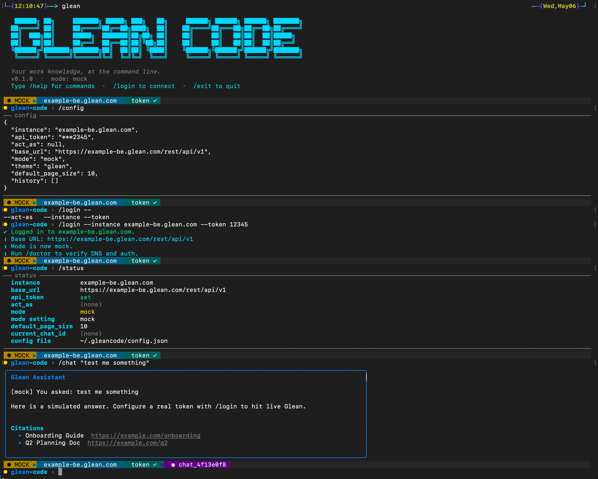
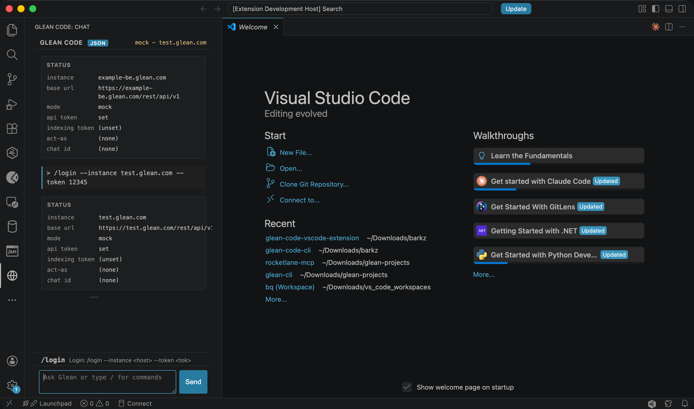

# Glean Code


[](https://github.com/barkz/glean-code-cli/actions/workflows/release.yml)

A local, terminal-first client for the Glean Client REST API. Inspired by Claude Code. Built in Python with zero runtime dependencies.



## Highlights

- **One-command install, and a Spotlight-launchable macOS app** — `python3 install.py` builds a
  single-file zipapp (~84 KB, still zero dependencies) and puts `glean` on your PATH, plus a
  registered `Glean Code.app` so `Cmd+Space` → "Glean Code" opens the REPL.
  [#11](https://github.com/barkz/glean-code-cli/pull/11) ·
  [`e46d517`](https://github.com/barkz/glean-code-cli/commit/e46d517)
- **Every REST call audited against Glean's published OpenAPI spec** — the new
  [incompatibility report](incompat_report.md) documents 12 Client API divergences from spec
  `0.9.0`, with locations and fixes. Indexing and Custom Metadata verified clean.
  [#10](https://github.com/barkz/glean-code-cli/pull/10) ·
  [`f81902d`](https://github.com/barkz/glean-code-cli/commit/f81902d)
- **Repo hygiene fixes** — removed 35 tracked `__pycache__` artifacts, corrected stale docs
  (the documented test count was stale by over a hundred), and dropped a Spotlight ignore rule that macOS never
  honored.
  [#12](https://github.com/barkz/glean-code-cli/pull/12) ·
  [`17199b5`](https://github.com/barkz/glean-code-cli/commit/17199b5)

## Contents

- [Highlights](#highlights) — what landed recently
- [Overview](#overview)
- [Getting started](#getting-started) — install, alias, first run
- [Coming soon](#coming-soon)
- [Commands at a glance](#commands-at-a-glance)
- [Mock mode](#mock-mode)
- [Natural-language planner](#natural-language-planner)
- [Tokens and auth](#tokens-and-auth)
- [Config keys](#config-keys)
- [MCP server](#mcp-server)
- [Project layout](#project-layout)
- [Running tests](#running-tests)
- [Documentation](#documentation) — the full reference set
- ℹ️ [API incompatibility report](incompat_report.md) — known divergences from the Glean spec
- [Support](SUPPORT.md) — best-effort response expectations, how to report a bug
- [Changelog](CHANGELOG.md) — release history
- [License](#license)

## Overview

- **Every major Glean Client API surface as a slash command** — chat, search, agents, tools, docs, people, shortcuts (Go Links), answers, summarize, verification, messages, activity, announcements, collections, pins, and insights
- **Near-complete Indexing API coverage** across read/debug, single-record write, bulk, and process-all tiers — including a debug toolkit that answers "is this doc uploaded?" and "why can't user X see doc Y?" without leaving the REPL. See [docs/INDEXING.md](docs/INDEXING.md)
- **Custom Metadata API** for enriching already-indexed documents without re-uploading them. See [docs/METADATA.md](docs/METADATA.md)
- **Indexing from local files** — `/index.document --path file.md` and `/index.bulk-documents --path ./docs/` walk a file or folder and synthesize the request body for you, with `--dry-run` to inspect it first
- **Natural-language planner** — type `?login into acme-be.glean.com and search for "Q2 plan"` and Glean Assistant translates it into slash commands, validated locally and gated behind a single confirm for anything destructive
- **Offline by default** — a real mock corpus of interlinked documents across five faux datasources, so every command is explorable without credentials. See [docs/MOCK_CORPUS.md](docs/MOCK_CORPUS.md)
- **Browser SSO or API token** — `/auth login` runs OAuth 2.1 + PKCE against your instance, or paste a Glean-issued token. Secure refs keep real secrets in environment variables, never on disk
- **MCP server** (`glean_mcp.py`) for Claude Code, Claude Desktop, and Cursor
- Terminal niceties: `/help <command>` for every command, tab completion that cycles matches, a powerline-style status bar, and `/scaffold` to generate stdlib-only starter projects

## Getting started

### Run it straight from the repo

```bash
cd glean-code-cli
python3 -m glean_code
```

Python 3.9 or newer. No pip install required. Only the standard library is used.

### Or install it

```bash
python3 install.py
```

This builds a single-file zipapp (~84 KB, still stdlib-only) and installs it as
`glean` in `~/.local/bin`. On macOS it also creates `~/Applications/Glean Code.app`
and registers it with LaunchServices, so the REPL is launchable from Spotlight —
`Cmd+Space` → "Glean Code" → Enter opens it in a Terminal window.

| Flag | Effect |
| --- | --- |
| _(none)_ | Install the CLI and, on macOS, the Spotlight app |
| `--cli-only` | Skip the macOS app bundle |
| `--dev` | App launches from the working tree, so edits apply with no rebuild |
| `--prefix DIR` | Install the `glean` executable somewhere other than `~/.local/bin` |
| `--verify` | Report what is currently installed |
| `--uninstall` | Remove the CLI and the app bundle this installer created (config is left alone) |

Re-run `python3 install.py` after pulling changes to refresh the snapshot, or install
once with `--dev` and skip that step entirely.

**The bundle is called `Glean Code.app`, never `Glean.app`** — the latter is Glean's own
desktop client (`com.glean.desktop`). The installer reads `CFBundleIdentifier` before it
writes anything and refuses a bundle it did not create, and `--uninstall` skips one for the
same reason, so neither can damage an app it doesn't own:

```text
x ~/Applications/Glean Code.app already exists and belongs to another app
  (CFBundleIdentifier: com.glean.desktop).
  Refusing to write into it. Move or rename that bundle, or run with --cli-only.
```

If you installed before this change you have a `Glean.app` bundle that we do own; the next
`python3 install.py` removes it and replaces it with `Glean Code.app`. That's why the
Spotlight entry changes name — nothing is lost.

### Or just alias it

```bash
alias glean="PYTHONPATH=<YOUR_PATH>/glean-code-cli python3 -m glean_code"
```

### First run

**Browser SSO (no API token to paste)** — opens your browser for Glean → your company IdP, then stores OAuth tokens in `~/.gleancode/auth.json`:

```text
/auth login --instance acme-be.glean.com
/status
/search "quarterly planning"
/chat "summarise the Q2 plan"
```

Details: [docs/SSO_OAUTH.md](docs/SSO_OAUTH.md).

**API token** — paste a Glean-issued Client API token (same live API, different auth path):

```text
/login --instance acme-be.glean.com --token <bearer_token>
/status
/search "quarterly planning"
/chat "summarise the Q2 plan"
```

Without Client API credentials (no `/auth` session and no `/login` token) the CLI runs in **mock** mode. After `/auth login` or `/login`, it switches to live calls against `https://<instance>/rest/api/v1`.

## Coming soon

### Visual Studio Code Extension

A native VS Code extension that brings the full Glean Code REPL — slash commands, status bar, mock/live switching, secure-token storage — into the editor sidebar. Run searches, kick off agents, and pin docs without leaving your code window.



## Commands at a glance

| Area | Commands |
| --- | --- |
| Shell | `/help` `/status` `/doctor` `/auth` `/login` `/logout` `/open` `/ask` `/config` `/mode` `/mcp` `/history` `/clear` `/exit` |
| Chat and search | `/chat` `/search` `/autocomplete` `/recommendations` `/feedback` `/datasources.list` |
| Indexing — read & debug | `/datasources.status` `/datasources.config` `/documents.status` `/documents.count` `/users.count` `/documents.access` `/debug.document` `/debug.documents` `/debug.user` `/indexing.rotate-token` |
| Indexing — single write | `/index.document` `/index.permissions` `/index.user` `/index.group` `/index.membership` and their `/index.delete-*` partners |
| Indexing — bulk & process-all | `/index.documents` `/index.bulk-documents` `/index.bulk-users` `/index.bulk-groups` `/index.bulk-memberships` `/shortcuts.bulk-index` `/shortcuts.upload` `/index.process-all-documents` `/index.process-all-memberships` |
| Indexing — people (org chart) | `/people.bulk-employees` `/people.bulk-teams` `/people.index-employee-list` `/people.process-all-employees-teams` |
| Custom metadata | `/metadata.set-schema` `/metadata.get-schema` `/metadata.delete-schema` `/metadata.attach` `/metadata.detach` |
| Insights & activity | `/insights` `/activity.report` |
| Agents and tools | `/agents.list` `/agents.run` `/tools.list` `/tools.call` |
| Docs and people | `/docs.get` `/docs.permissions` `/entities.list` `/people.get` |
| Announcements, collections, pins | `/announcements.list` `/announcements.create` `/announcements.delete` `/collections.list` `/collections.create` `/collections.delete` `/pins.list` `/pins.create` `/pins.delete` |
| Shortcuts (Go Links) | `/shortcuts.list` `/shortcuts.get` `/shortcuts.create` `/shortcuts.update` `/shortcuts.delete` |
| Answers | `/answers.list` `/answers.get` `/answers.create` `/answers.update` `/answers.delete` |
| Verification | `/verification.list` `/verification.verify` `/verification.remind` |
| Summarize & messages | `/summarize` `/messages.get` |
| Scaffold | `/scaffold chat` `/scaffold search` `/scaffold agent` |

Type `/help <command>` for parameters, examples, and the underlying REST endpoint. Bare text with no leading slash is a shortcut for `/chat`.

**Full per-command reference — usage, parameters, examples, endpoints — is in [docs/COMMANDS.md](docs/COMMANDS.md).**

## Mock mode

Every command works offline. With no credentials configured, Glean Code serves ranked results from a built-in corpus of seventy interlinked documents belonging to one fictional company, spread evenly across five faux datasources (`gdrive`, `confluence`, `jira`, `github`, `slack` — fourteen each).

Because every mock endpoint reads from the same corpus, offline mode behaves like one coherent index rather than a pile of placeholders — a URL from `/search` resolves in `/docs.get`, `/summarize`, and `/chat` citations:

```text
/search "quarterly planning"                    # ranked against the corpus
/search "checkout incident" --datasource jira   # the datasource filter really filters
/summarize --url <url from result 2>            # summarises that same document
/docs.get --url <url from result 2>             # same title, author and datasource
/chat "how do we run quarterly planning?"       # cites documents that exist
```

Point `mock_corpus_path` at a JSON file to swap in your own corpus for a tailored demo. Full reference, document inventory, ranking notes, and the custom-corpus file format: **[docs/MOCK_CORPUS.md](docs/MOCK_CORPUS.md)**.

## Natural-language planner

Don't remember the exact slash-command incantation? Describe what you want and Glean Assistant translates it into commands for you.

```text
?login into acme-be.glean.com with my stored token, then search for "Q2 plan"
/ask "show me datasource health and start a chat"
```

Both forms invoke the same handler — `?` is the REPL shorthand, `/ask "..."` is the explicit form (handy for scripts and pipes). Glean Code builds a catalogue of every registered command, sends it with your request, validates each returned step against the live command set, and shows a numbered plan. Pure reads run automatically; writes, deletes, and auth changes trigger a single `Run all? [y/N]` gate. Tokens never leave the local process — the planner sees only the placeholder `<stored>`.

It works offline too: in mock mode the CLI pattern-matches locally and emits a canned plan instead of calling Glean.

Full design — architecture, prompt template, destructive set, troubleshooting: **[docs/NATURAL_LANGUAGE.md](docs/NATURAL_LANGUAGE.md)**.

## Tokens and auth

Three ways to authenticate, in order of preference:

| Method | How | Notes |
| --- | --- | --- |
| Browser SSO | `/auth login --instance <host>` | OAuth 2.1 + PKCE, same SSO path as the web app. Tokens in `~/.gleancode/auth.json`. See [docs/SSO_OAUTH.md](docs/SSO_OAUTH.md) |
| Secure ref | `/login --token token.secure.client` | Config stores the reference name; the real secret resolves from `$GLEAN_CLIENT_TOKEN` at request time. See [docs/SECURE_TOKENS.md](docs/SECURE_TOKENS.md) |
| Literal token | `/login --token <bearer_token>` | Written to `~/.gleancode/config.json` with `0o600` perms, masked to `***1234` everywhere it displays |

The Client API and the Indexing API take **separate tokens** — a Client token cannot reach `/api/index/v1`. Set the indexing one with `/config set indexing_token <token-or-secure-ref>`. Indexing still uses a Glean-issued token even when the Client API is on SSO.

Tokens are stripped from the in-memory history buffer and masked on every display surface. See [docs/SECURE_TOKENS.md](docs/SECURE_TOKENS.md) for the full masking matrix.

## Config keys

| Key | Description | Values |
| --- | --- | --- |
| `instance` | Glean backend host | e.g. `acme-be.glean.com` |
| `api_token` | Client API bearer token | Glean-issued token, or a secure ref like `token.secure.client` |
| `indexing_token` | Indexing API token | Glean-issued token, or `token.secure.indexing` |
| `act_as` | Impersonate a user via `X-Glean-ActAs` | Email address |
| `base_url` | Override the computed base URL | Full URL |
| `mode` | API mode | `auto` (default), `live`, `mock` |
| `theme` | Terminal colour theme | `glean` (default), `mono`, `neon` |
| `default_page_size` | Default result count for search and entities | Integer, default `10` |
| `mock_corpus_path` | JSON file backing mock mode | Path; unset uses the built-in corpus |
| `window_title` | Terminal window/tab title | `full` (default, includes the instance host), `plain` (mode only), `off` |

Config lives at `~/.gleancode/config.json`. Change any key with `/config set <key> <value>`. Use `/mode live|mock|auto` to force a mode without editing config.

## MCP server

`glean_mcp.py` exposes Glean as an MCP server so Claude Code, Claude Desktop, and Cursor can call Glean search, chat, and agents as native tools. It reads the same `~/.gleancode/config.json` but forces live mode, so MCP tools hit the real API by default — mock mode is opt-in via `GLEAN_MOCK` and every mock response carries a visible fabricated-data banner.

Requires Python 3.10+ and the **v1 line** of the `mcp` package — install it as
`mcp[cli]>=1,<2`. mcp 2.0.0 renamed `FastMCP` to `MCPServer` and removed the module this
server imports, so an unpinned install breaks it ([details](docs/MCP.md#mcp-sdk-v2)). The
REPL itself remains Python 3.9+ and stdlib-only.

`/mcp` drives it from inside the REPL — `/mcp status` for version and health, `/mcp config
<client>` for the paste-ready JSON, and `/mcp start` to run one detached over HTTP when you
want a server that isn't owned by a client.

Setup for all three clients, the tool table, and the mock-mode rationale: **[docs/MCP.md](docs/MCP.md)**.

## Project layout

```text
glean-code-cli/
  install.py              CLI + macOS app installer (python3 install.py)
  glean_mcp.py            MCP server entry point
  glean_code/
    __main__.py           python -m glean_code
    cli.py                REPL loop and banner
    commands.py           slash command parser and handlers
    client.py             Glean REST wrapper + mock responses
    config.py             config file load and save
    help_docs.py          per-command documentation
    mcp_control.py        /mcp — MCP server diagnostics and process control
    mock_corpus.py        the fake corpus every mock endpoint reads from
    _indexing_walk.py     --path file walking for indexing commands
    completion.py         readline tab completion
    scaffold.py           project scaffold templates
    ui.py                 ASCII art, colours, boxes
    auth_commands.py      /auth command handlers
    auth/                 OAuth 2.1 + PKCE: oauth, pkce, callback_server,
                          token_store, manager
  tests/                  17 test modules, stdlib unittest only
  docs/                   full reference set — see below
```

## Running tests

The test suite uses only the standard library (no mocking frameworks, no network calls).

```bash
python3 -m pytest tests/
```

Or without pytest:

```bash
python3 -m unittest discover tests/
```

On macOS, keep bytecode caches out of the working tree — Spotlight indexes stray `.pyc`
files, and they outrank the `Glean Code.app` launcher in `Cmd+Space`:

```bash
export PYTHONPYCACHEPREFIX="$HOME/.cache/python"
```

776 tests covering the client and every mock response, commands and dispatch, config, UI, auth, completion, help docs, the mock corpus, indexing-walk, scaffold, the installer, and the MCP server. Development notes: [docs/TESTING.md](docs/TESTING.md).

## Documentation

| Doc | What's in it |
| --- | --- |
| [docs/COMMANDS.md](docs/COMMANDS.md) | Full per-command reference — usage, parameters, examples, endpoints |
| [docs/INDEXING.md](docs/INDEXING.md) | Indexing API: read/debug, writes, bulk, process-all, `--path` mode |
| [docs/METADATA.md](docs/METADATA.md) | Custom Metadata API: schemas and document attachment |
| [docs/INSIGHTS.md](docs/INSIGHTS.md) | `/insights` flags, output, and CSV export |
| [docs/MOCK_CORPUS.md](docs/MOCK_CORPUS.md) | The offline corpus — inventory, ranking, bring-your-own format |
| [docs/NATURAL_LANGUAGE.md](docs/NATURAL_LANGUAGE.md) | Planner design, prompt template, destructive set |
| [docs/SSO_OAUTH.md](docs/SSO_OAUTH.md) | Browser SSO via OAuth 2.1 + PKCE |
| [docs/SECURE_TOKENS.md](docs/SECURE_TOKENS.md) | Secure refs, masking matrix, mock-mode fallback |
| [docs/MCP.md](docs/MCP.md) | MCP server setup for Claude Code, Claude Desktop, Cursor |
| [docs/REST_PATHS.md](docs/REST_PATHS.md) | Every REST path this client targets, and how to retarget them |
| [docs/TESTING.md](docs/TESTING.md) | Test-suite development notes |
| [SUPPORT.md](SUPPORT.md) | Best-effort support expectations, triage order, how to file a good bug report |
| [CHANGELOG.md](CHANGELOG.md) | Release history |
| ℹ️ [git/incompat_report.md](git/incompat_report.md) | **API incompatibility report** — where the client diverges from the published Glean OpenAPI spec |

> [!NOTE]
> ℹ️ **Known API incompatibilities.** Twelve Client API commands currently diverge from Glean's
> published OpenAPI spec — seven return 404/405/400 against a live tenant. The Indexing and
> Custom Metadata surfaces are unaffected. Mock mode masks all of it, so the test suite passes.
> Full detail, locations, and suggested fixes: **[git/incompat_report.md](git/incompat_report.md)**.

---

## License

[](LICENSE)

[MIT](LICENSE) © 2026 barkz
