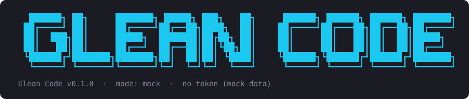
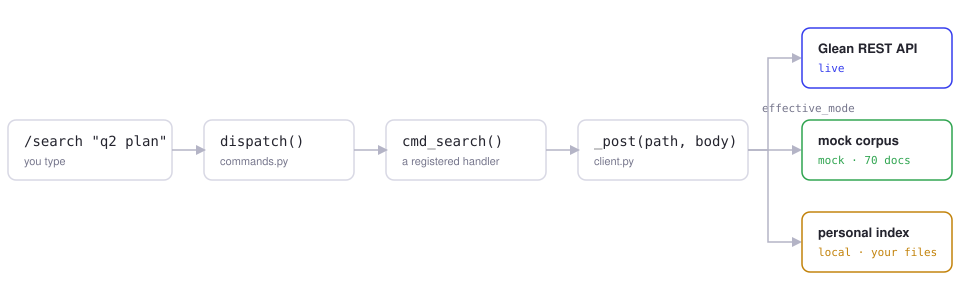
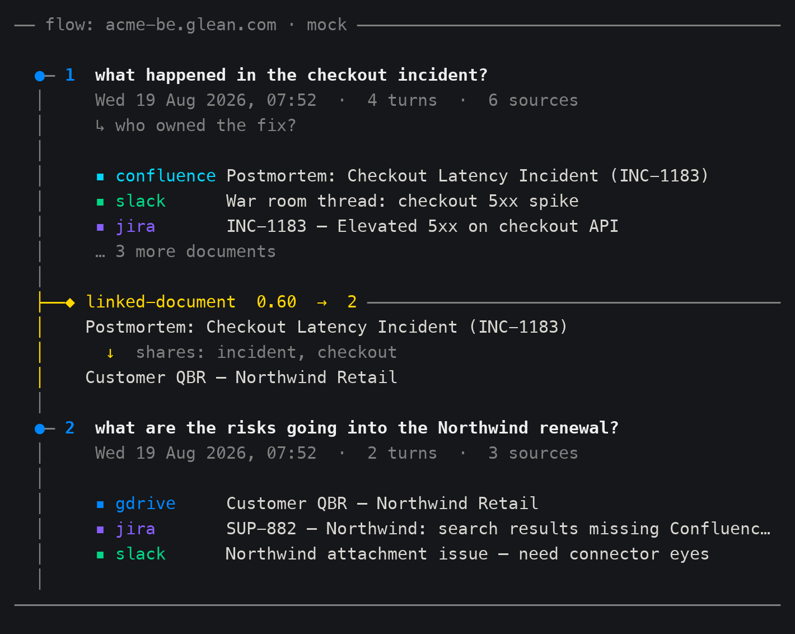

<div align="center">



**Your whole Glean workspace, from the terminal.**

Chat, search, agents, tools, insights, and near-complete Indexing API coverage —
in a fast local REPL inspired by Claude Code.
Pure Python. Zero runtime dependencies. Fully usable before you even log in.


[](https://github.com/barkz/glean-code-cli/actions/workflows/release.yml)
[](LICENSE)

<br>


</div>

<br>

## Why Glean Code

|  |  |
| --- | --- |
| ⚡ **No install ceremony** | `python3 install.py` builds an ~84 KB single-file zipapp, puts `glean` on your PATH, and — on macOS — makes it Spotlight-launchable. Still zero dependencies |
| 🧪 **Offline by default** | Seventy interlinked documents across five faux datasources back every mock response, so the whole CLI is explorable with no tenant, no token, no network |
| 🔑 **Browser SSO** | `/login acme` runs OAuth 2.1 + PKCE through your normal SSO. Or bring a token — secure refs keep the real secret in an env var, never on disk |
| 🗣️ **Talk to it in English** | `?search for the Q2 plan and summarise it` — Glean Assistant writes the commands, the CLI validates them, and anything destructive waits behind one confirm |
| 🗺️ **It remembers what you investigated** | `/flow` links today's incident to last month's renewal because a cited doc mentioned it in passing — with the evidence attached |
| 🏠 **Your own files, indexed locally** | `/personal index ~/Documents` builds a portable SQLite index — `.md`, `.html`, `.json`, even `.docx`/`.xlsx`/`.pptx` — then `/mode local` searches it. One file, no server, no network |

<br>

## Quickstart

```bash
python3 -m glean_code          # straight from the repo
# or
python3 install.py && glean    # installed, with a macOS Spotlight app
```

```text
/login acme
/search "quarterly planning"
/chat "summarise the Q2 plan"
```

`/login acme` opens browser SSO; `/login --token <bearer_token>` takes a Glean-issued token instead. No login at all? You're still up and running — mock mode serves ranked results from a real corpus.

**→ [Install guide](docs/INSTALL.md)** · **[Configuration](docs/CONFIGURATION.md)** · **[Command index](docs/COMMAND_INDEX.md)**

<br>

## What you can do

| Command | What it does |
| --- | --- |
| `?login into acme and search for "Q2 plan"` | Natural language, planned and confirmed before anything runs |
| `/search "checkout incident" --datasource jira` | Search every connected source |
| `/chat "what changed in the pricing doc?"` | Threaded Glean Assistant chat |
| `/agents.run <agent-id> "draft the release notes"` | Run agents, call tools |
| `/insights --all --export insights.csv` | Usage metrics straight to CSV |
| `/debug.user gdrive alice@example.com` | Why can't Alice see that doc? |
| `/index.bulk-documents --path ./docs/ --datasource custom1 --object-type Article --dry-run` | Index a folder, inspecting the payload first |
| `/metadata.attach --doc-id <id> --group tickets --values owner=alice` | Enrich docs without re-uploading them |
| `/personal index ~/Documents --label docs` | Index your own files, locally |
| `/flow show` | Draw the investigations you ran |

<table>
<tr><td width="50%" valign="top">

### 🔎 Search &amp; chat
Search, autocomplete, recommendations, threaded chat, summarize, answers, feedback — plus docs, people, entities, announcements, collections, pins, Go Links, and verification.

</td><td width="50%" valign="top">

### 🤖 Agents &amp; tools
List and run agents, list and call tools with inline JSON arguments, and read the results back in the terminal.

</td></tr>
<tr><td width="50%" valign="top">

### 🧱 Indexing
Read/debug toolkit, single-record writes, bulk + paged uploads, process-all rebuilds, custom metadata, and `--path` mode that turns a local folder into an indexed datasource.
[Indexing](docs/INDEXING.md) · [Metadata](docs/METADATA.md)

</td><td width="50%" valign="top">

### 📊 Insights
MAU/WAU, sign-ups, search satisfaction, clicks by datasource, Assistant and Agent activity — `--export` dumps it all to flat CSV.
[Insights](docs/INSIGHTS.md)

</td></tr>
<tr><td width="50%" valign="top">

### 💬 Natural language
`?` or `/ask` turns plain English into a validated command plan. Tokens never leave the local process, and it works offline too.
[Planner design](docs/NATURAL_LANGUAGE.md)

</td><td width="50%" valign="top">

### 🛠️ Terminal craft
`/help` for every command, tab completion that cycles matches, a powerline-style status bar, themes, and `/scaffold` for stdlib-only starter projects.
[Commands](docs/COMMANDS.md)

</td></tr>
</table>

<br>

## How it works

Every command takes the same path: parsed, dispatched to a handler, turned into one REST call. The mode decides who answers it — and mock and local replies are labelled in the output, so you always know which index you are reading.



<br>

## Flow mapper

`/flow` records the investigations you run — every `/chat` and `/search`, and the documents they cited — then finds the connections between them. Not only "both mentioned INC-1183", but the indirect case: two conversations sharing no vocabulary, linked because a document cited by one refers to the other's subject in passing.



Sessions run down a rail in the order you worked; each connection branches off it carrying the evidence that earned it, so every link can be read rather than taken on trust. `/flow timeline` renders the same graph as a self-contained HTML page. Local SQLite, mock-only by default — recording live data is opt-in.

**→ [Flow mapper guide](docs/FLOW_MAPPER.md)**

<br>

## Glean Personal

Mock mode proves every command works offline against a fictional corpus. `/personal` points the same machinery at content that is actually yours.

| Command | What it does |
| --- | --- |
| `/personal index ~/Documents --label docs` | Build the index from a folder |
| `/personal search "salary bands" --explain` | Which terms hit, which missed, and the bm25 score |
| `/personal link && /personal related roadmap` | A phrase graph, with shared phrases as evidence |
| `/mode local` | `/search` and `/chat` now answer from your files |

SQLite FTS5, incremental on a content hash, `.docx`/`.xlsx`/`.pptx` read straight out of their ZIP-XML with the stdlib. **No server, no daemon, no Docker, no network, no credentials** — the whole index is one file you can copy between machines. Answers are labelled `[LOCAL INDEX]` and quote your passages verbatim; the REPL has no model in-process and will not invent prose. Four MCP tools expose the same index to an agent that does.

**→ [How-to guide](docs/LOCAL_INDEXING.md)** · **[Reference & design notes](docs/PERSONAL.md)**

<br>

## Coming soon

### Visual Studio Code extension

The full Glean Code REPL — slash commands, status bar, mock/live switching, secure-token storage — in the editor sidebar. Run searches, kick off agents, and pin docs without leaving your code window.


<br>

## Documentation

| | |
| --- | --- |
| 🚀 **[Install](docs/INSTALL.md)** | Run from the repo, the zipapp installer, the macOS app, first run |
| ⚙️ **[Configuration](docs/CONFIGURATION.md)** | Auth methods, every config key, modes, files on disk |
| 🗂️ **[Command index](docs/COMMAND_INDEX.md)** | Every command, grouped by surface |
| 📖 **[Command reference](docs/COMMANDS.md)** | Usage, parameters, examples, endpoints |
| 💬 **[Natural language](docs/NATURAL_LANGUAGE.md)** | How `/ask` plans, validates, and confirms |
| 🧱 **[Indexing](docs/INDEXING.md)** · **[Metadata](docs/METADATA.md)** | Debug toolkit, writes, bulk, process-all, `--path`, custom metadata |
| 📊 **[Insights](docs/INSIGHTS.md)** | Flags, output, and CSV export |
| 🧪 **[Mock corpus](docs/MOCK_CORPUS.md)** | The offline corpus — inventory, ranking, bring-your-own format |
| 🏠 **[Local indexing](docs/LOCAL_INDEXING.md)** · **[Personal](docs/PERSONAL.md)** | Index your own folders, search them, keep them current |
| 🗺️ **[Flow mapper](docs/FLOW_MAPPER.md)** | Capturing investigations, linking them, retention questions |
| 🔐 **[SSO / OAuth](docs/SSO_OAUTH.md)** · **[Secure tokens](docs/SECURE_TOKENS.md)** | Browser sign-in, secure refs, the masking matrix |
| 🔌 **[MCP server](docs/MCP.md)** | Glean as native tools in Claude Code, Claude Desktop, Cursor |
| 🏛️ **[Architecture](docs/ARCHITECTURE.md)** · **[REST paths](docs/REST_PATHS.md)** | Module map, request flow, endpoints, how to add a command |
| ✅ **[Testing](docs/TESTING.md)** | Running the 1,100-test suite and what it covers |
| 🛟 **[Support](SUPPORT.md)** · **[Changelog](CHANGELOG.md)** | How to report a bug · release history |

> [!NOTE]
> ℹ️ **Known API incompatibilities.** Twelve Client API commands currently diverge from Glean's
> published OpenAPI spec — seven return 404/405/400 against a live tenant. The Indexing and
> Custom Metadata surfaces are unaffected, and mock mode masks all of it. Full detail,
> locations, and suggested fixes: **[incompat_report.md](incompat_report.md)**.

<br>

---

<div align="center">

[MIT](LICENSE) © 2026 barkz

</div>
