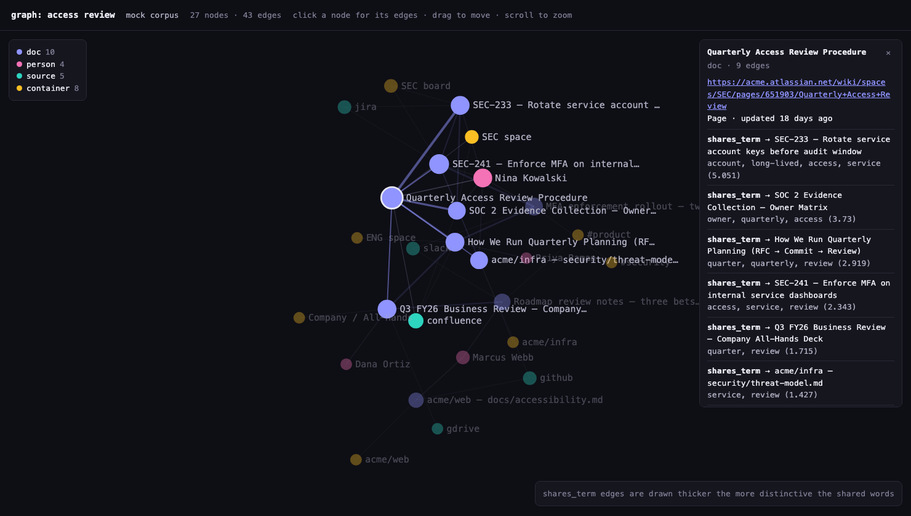

# Knowledge Graph

`/graph` draws how the content behind a query relates to itself: which documents share
vocabulary, who wrote them, and where they live. It answers the question a flat list of
search results cannot — *what is this cluster of material, and who owns it?*

```text
/graph "quarterly planning"
/graph "checkout incident" --html incident-graph.html
```

## Why it is built locally

The Glean Client API has no graph endpoint. What it does return, on every search result, is
the author, the datasource, the container, and snippets of the text. That is enough to build
a graph — and building it client-side has three consequences worth stating plainly:

- **It is the graph of one query's result set**, not a crawl of the whole index. `--page-size`
  is therefore the size of the graph.
- **It works identically in mock, local and live mode**, because all three return the same
  response shape. No endpoint to stub, no shape to keep in sync.
- **Nothing leaves the process.** The graph, the layout and the HTML are all computed locally.

## The model

| Node | Comes from |
| --- | --- |
| `doc` | A document in the result set |
| `person` | `metadata.author` — name and email |
| `source` | `metadata.datasource` |
| `container` | `metadata.container` — a folder, channel or space |

| Edge | Meaning | Evidence it carries |
| --- | --- | --- |
| `authored_by` | `doc` → `person` | "author of this document" |
| `in_source` | `doc` → `source` | "indexed from gdrive" |
| `in_container` | `doc` → `container` | "lives in #planning" |
| `shares_term` | `doc` ↔ `doc` | The shared words themselves |

### How `shares_term` is scored

Every document's title and snippets are reduced to terms — lowercase, four characters or
more, stopwords dropped. A term is then weighted by how rare it is *within this result set*:

```
weight(term) = log(total_docs / docs_containing_term)
```

Terms appearing in more than 60% of the set are discarded before scoring, because those are
almost always the query itself: in a search for "quarterly planning", the words *quarterly*
and *planning* say nothing about how two of the results differ. An edge is drawn when two
documents share at least `--min-shared` of the surviving terms, and its score is the sum of
their weights.

This is the same idea `/flow` uses to link investigations, and for the same reason: a link you
cannot inspect is a link you have to take on trust. Every edge names its evidence, so
`shares capacity, model, fy26 (4.7)` can be judged rather than believed.

## Reading the terminal view

```text
27 nodes   10 doc  ·  4 person  ·  4 source  ·  9 container
40 edges   10 authored_by  ·  10 in_source  ·  10 in_container  ·  10 shares_term

hubs
  ▪ doc       Questions on the capacity model numbers   7 edges
  ◆ person    Priya Raman                               4 edges

clusters (1)
  27 nodes — anchored on doc Questions on the capacity model numbers

strongest content links
  Headcount and Budget Model FY26
    ↓ shares feeds, capacity, model, fy26 (4.7)
  PLAN-482 — Q4 FY26 planning: engineering capacity model
```

**Hubs** are ranked by degree, so the documents everything else touches surface first.
**Clusters** are connected components — more than one means the query pulled in unrelated
material, which is itself worth knowing. **Strongest content links** are the `shares_term`
edges in score order.

## The HTML view

`--html <path>` writes a self-contained page: one file, no CDN, no framework, no network —
the same constraint `/flow timeline` works under.



*`/graph "access review" --html access.html` against the mock corpus, with the hub document
selected. Its neighbours stay lit while everything else dims, and the panel lists all nine of
its edges — each with the words that earned it and the score they carry.*

Inside it:

- A force-directed layout, seeded from deterministic ring positions so the same graph opens
  the same way, then relaxed in the browser.
- Nodes coloured by kind and sized by degree.
- Pan by dragging the background, zoom on scroll, drag a node to pull the layout around it.
  The view auto-frames the graph while it settles and stops the moment you take over.
- Click any node for a panel listing every edge it has, each with its evidence and score.
- Light and dark, following the reader's system setting. `prefers-reduced-motion` skips the
  animated relaxation and draws the settled layout directly.

## Limits worth knowing

- **Local mode has no people.** Plain files carry no author, so a graph of the personal index
  has `doc`, `source` and `container` nodes only. The command tells you instead of leaving a
  silent gap.
- **Layout cost is O(n²) per tick.** Fine to a few hundred nodes, which is well past a
  sensible `--page-size`; it is not a whole-index visualiser.
- **Authorship is whoever the connector recorded.** A document indexed under a service account
  is attributed to that account, exactly as Glean holds it.
